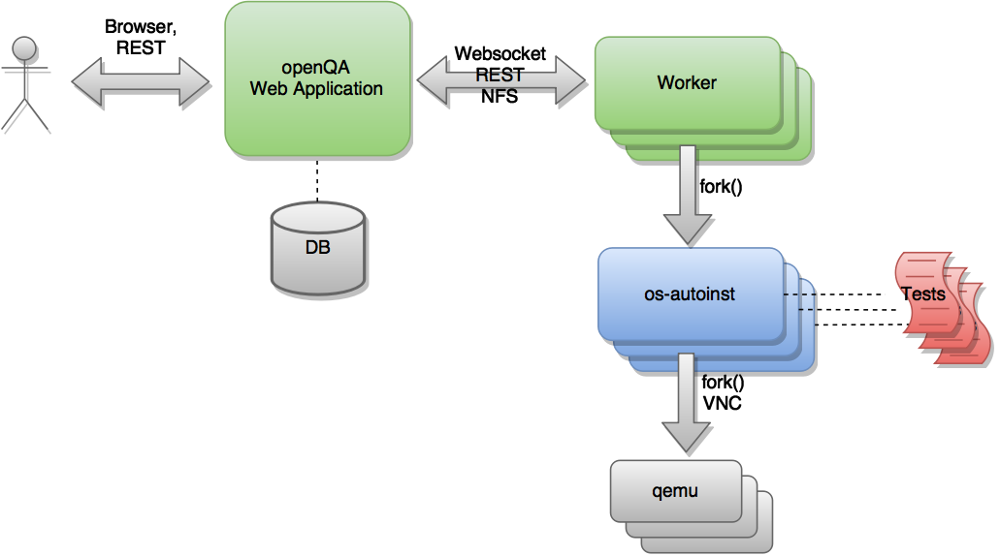

# Introduction

openQA is an automated test tool that makes it possible to test the whole
installation process of an operating system. It uses virtual machines to
reproduce the process, check the output (both serial console and
screen) in every step and send the necessary keystrokes and commands to
proceed to the next. openQA can check whether the system can be installed,
whether it works properly in 'live' mode, whether applications work
or whether the system responds as expected to different installation options and
commands.

Even more importantly, openQA can run several combinations of tests for every
revision of the operating system, reporting the errors detected for each
combination of hardware configuration, installation options and variant of the
operating system.

openQA is free software released under the
[GPLv2 license](http://www.gnu.org/licenses/gpl-2.0.html). The source code and
documentation are hosted in the [os-autoinst
organization on GitHub](https://github.com/os-autoinst).

This document describes the general operation and usage of openQA. The main goal
is to provide a general overview of the tool, with all the information needed to
become a happy user.

For a quick start, if you already have an openQA instance available you can
refer to the section
[Cloning existing jobs - openqa-clone-job](UsersGuide.md#cloning_existing_jobs_openqa_clone_job)
directly to trigger a new test based on already existing job. For a quick
installation refer directly to
[Quick bootstrapping under openSUSE](Installing.md#bootstrapping) or
[Container based setup](Installing.md#container_setup).

For the installation of openQA in general see the
[Installation Guide](Installing.md#installing), as a user of an
existing instance see the [Users Guide](UsersGuide.md#usersguide).
More advanced topics can be found in other documents. All documents are also
available in the [official repository](https://github.com/os-autoinst/openQA).

# Architecture


Although the project as a whole is referred to as openQA, there are in fact
several components that are hosted in separate repositories as shown in
[the following figure](#arch_img).

</div>

<a id="arch_img"></a>

<figure>

<figcaption aria-hidden="true">openQA architecture</figcaption>
</figure>

</div>

The heart of the test engine is a standalone application called 'os-autoinst'
(blue). In each execution, this application creates a virtual machine and uses
it to run a set of test scripts (red). 'os-autoinst' generates a video,
screenshots and a JSON file with detailed results.

'openQA' (green) on the other hand provides a web based user interface and
infrastructure to run 'os-autoinst' in a distributed way. The web interface
also provides a JSON based REST-like API for external scripting and for use by
the worker program. Workers fetch data and input files from openQA for
os-autoinst to run the tests. A host system can run several workers. The openQA
web application takes care of distributing test jobs among workers. Web
application and workers can run on the same machine as well as connected via
network on multiple machines within the same network or distributed. Running
the web application as well as the workers in the cloud is perfectly possible.

Note that the diagram shown above is simplified. There exists
[a more sophisticated version](images/architecture.svg) which is more
complete and detailed. (The diagram can be edited via its underlying
[GraphML file](images/architecture.graphml).)

# Basic concepts

## Glossary

The following terms are used within the context of openQA:

**test modules**
: an individual test case in a single perl module file, e.g. "sshxterm". If not
further specified a test module is denoted with its "short name" equivalent to
the filename including the test definition. The "full name" is composed of the
_test group_ (TBC), which itself is formed by the top-folder of the test module
file, and the short name, e.g. "x11-sshxterm" (for x11/sshxterm.pm)

**test suite**
: a collection of _test modules_, e.g. "textmode". All _test modules_ within one
_test suite_ are run serially

**job**
: one run of individual test cases in a row denoted by a unique number for one
instance of openQA, e.g. one installation with subsequent testing of
applications within gnome

**test run**
: equivalent to _job_

**test result**
: the result of one job, e.g. "passed" with the details of each individual _test
module_

**test step**
: the execution of one _test module_ within a _job_

**distri**
: a test distribution but also sometimes referring to a _product_ (CAUTION:
ambiguous, historically a "GNU/Linux distribution"), composed of multiple _test
modules_ in a folder structure that compose _test suites_, e.g. "opensuse" (test
distribution, short for "os-autoinst-distri-opensuse")

**needles**
: reference images to assert whether what is on the screen matches expectations
and to locate elements on the screen the tests needs to interact with (e.g. to
locate a button to click on it)

**product**
: the main "system under test" (SUT), e.g. "openSUSE", also called "Medium
Types" in the web interface of openQA

**job group**
: equivalent to _product_, used in context of the webUI

**version**
: one version of a _product_, don't confuse with _builds_, e.g. "Tumbleweed"

**flavor**
: a specific variant of a _product_ to distinguish differing variants, e.g.
"DVD"

**arch**
: an architecture variant of a _product_, e.g. "x86_64"

**machine**
: additional variant of machine, e.g. used for "64bit", "uefi", etc.

**scenario**
: A composition of `<distri>-<version>-<flavor>-<arch>-<test_suite>@<machine>`,
e.g. "openSUSE-Tumbleweed-DVD-x86_64-gnome@64bit", nicknamed _koala_

**build**
: Different versions of a product as tested, can be considered a "sub-version"
of _version_, e.g. "Build1234"; **CAUTION:** ambiguity: either with the prefix
"Build" included or not

## Jobs

One of the most important features of openQA is that it can be used to test
several combinations of actions and configurations. For every one of those
combinations, the system creates a virtual machine, performs certain steps and
returns an overall result. Every one of those executions is called a 'job'.
Every job is labeled with a numeric identifier and has several associated
'settings' that will drive its behavior.

A job goes through several states. Here is (an incomplete list) of these
states:

- **scheduled** Initial state for newly created jobs. Queued for future
  execution.

- **setup**/**running**/**uploading** In progress.

- **cancelled** The job was explicitly cancelled by the user or was
  replaced by a clone (see below) and the worker has not acknowledged the
  cancellation yet.

- **done** The worker acknowledged that the execution finished or the web UI
  considers the job as abandoned by the worker.

Jobs in the final states 'cancelled' and 'done' have typically gone through a
whole sequence of steps (called 'testmodules') each one with its own result.
But in addition to those partial results, a finished job also provides an
overall result from the following list.

- **none** For jobs that have not reached one of the final states.

- **passed** No critical check failed during the process. It does not necessarily
  mean that all testmodules were successful or that no single assertion failed.

- **failed** At least one assertion considered to be critical was not satisfied at some
  point.

- **softfailed** At least one known, non-critical issue has been found. That could be
  that workaround needles are in place, a softfailure has been recorded explicitly
  via `record_soft_failure` (from os-autoinst) or a job failure has been ignored
  explicitly via a [job label](UsersGuide.md#labels).

- **timeout_exceeded** The job was aborted because `MAX_JOB_TIME` or `MAX_SETUP_TIME`
  has been exceeded, see [Changing timeout](WritingTests.md#changing_timeouts) for details.

- **skipped** Dependencies failed so the job was not started.

- **obsoleted** The job was superseded by scheduling a new product.

- **parallel_failed**/**parallel_restarted** The job could not continue because a job
  which is supposed to run in parallel failed or was restarted.

- **user_cancelled**/**user_restarted** The job was cancelled/restarted by the user.

- **incomplete** The test execution failed due to an unexpected error, e.g. the network
  connection to the worker was lost.

Sometimes, the reason of a failure is not an error in the tested operating system
itself, but an outdated test or a problem in the execution of the job for some
external reason. In those situations, it makes sense to re-run a given job from
the beginning once the problem is fixed or the tests have been updated.
This is done by means of 'cloning'. Every job can be superseded by a clone which
is scheduled to run with exactly the same settings as the original job. If the
original job is still not in 'done' state, it's cancelled immediately.
From that point in time, the clone becomes the current version and the original
job is considered outdated (and can be filtered in the listing) but its
information and results (if any) are kept for future reference.

## Needles

One of the main mechanisms for openQA to know the state of the virtual machine
is checking the presence of some elements in the machine's 'screen'.
This is performed using fuzzy image matching between the screen and the so
called 'needles'. A needle specifies both the elements to search for and a
list of tags used to decide which needles should be used at any moment.

A needle consists of a full screenshot in PNG format and a json file with
the same name (e.g. foo.png and foo.json) containing the associated data, like
which areas inside the full screenshot are relevant or the mentioned list of
tags.

```json
{
   "area" : [
      {
         "xpos" : INTEGER,
         "ypos" : INTEGER,
         "width" : INTEGER,
         "height" : INTEGER,
         "type" : ( "match" | "ocr" | "exclude" ),
         "match" : INTEGER, // 0-100. similarity percentage
         "click_point" : CLICK_POINT, // Optional click point
      },
      ...
   ],
   "tags" : [
      STRING, ...
   ]
}
```

### Areas
There are three kinds of areas:

- **Regular areas** define relevant parts of the screenshot. Those must match
  with at least the specified similarity percentage. Regular areas are
  displayed as green boxes in the needle editor and as green or red frames
  in the needle view (green for matching areas, red for non-matching ones).

- **OCR areas** also define relevant parts of the screenshot. However, an OCR
  algorithm is used for matching. In the needle editor OCR areas are
  displayed as orange boxes. To turn a regular area into an OCR area within
  the needle editor, double click the concerning area twice. Note that such
  needles are only rarely used.

- **Exclude areas** can be used to ignore parts of the reference picture.
  In the needle editor exclude areas are displayed as red boxes. To turn a
  regular area into an exclude area within the needle editor, double click
  the concerning area.
  In the needle view exclude areas are displayed as gray boxes.

### Click points
Each regular match area in a needle can optionally contain a **click point**.
This is used with the `testapi::assert_and_click` function to match GUI
elements such as buttons and then click inside the matched area.

```json
{
  "xpos" : INTEGER, // Relative coordinates inside the match area
  "ypos" : INTEGER,
  "id" : STRING,    // Optional
}
```

Each click point can have an `id`, and if a needle contains multiple click points
you must pass it to `testapi::assert_and_click` to select which click point
to use.

## Configuration

The different components of openQA read their configuration from the following
files:

- `openqa.ini`, `openqa.ini.d/*.ini`: These files are the "web UI" config.
  Services providing the web interface and related services such as the
  scheduler are configured via these files.

- `database.ini`, `database.ini.d/*.ini`: These files are also used by services
  providing the web interface and related services such as the scheduler. It is
  used to configure how those services connect to the database.

- `workers.ini`, `workers.ini.d/*.ini`: These files are used to configure the
  openQA worker including its additional cache service.

- `client.conf`, `client.conf.d/*.conf`: These files contain API credentials and
  are used by the openQA worker and other tooling such as `openqa-cli` and
  `openqa-clone-job` to authenticate with the web interface. One API key/secret
  can be configured per web UI host.

If these files are not present, defaults are used.

Example configuration files are installed under `/usr/share/doc/openqa/examples`
and in the
[Git repository under `etc/openqa`](https://github.com/os-autoinst/openQA/tree/master/etc/openqa).
Continue reading the next sections for where you can place the actual
configuration files and the possibility of creating drop-in configuration files.

### Locations

All configuration files can be placed under `/etc/openqa`,
e.g. `/etc/openqa/openqa.ini`. That is where administrators are expected to
store system-wide configuration.

Configuration files are also looked up under `/usr/etc/openqa` where a
[package maintainer](<https://en.opensuse.org/openSUSE:Packaging_UsrEtc#Variant_1_(ideal_case)>)
can place default values deviating from upstream defaults.

The client configuration can also be put under `~/.config/openqa/client.conf`.

For development, check out the section about
[customizing the configuration directory](Contributing.md#customize_configuration_directory).

### Drop-in configurations

It is recommended to split the configuration into multiple files and store these
"drop-in" configuration files in the `….d` sub directory, e.g.
`/etc/openqa/openqa.ini.d/01-plugins.ini`. This is possible for all config
files, e.g. `/etc/openqa/workers.ini.d/01-bare-metal-instances.ini` and
`/etc/openqa/client.conf.d/01-internal.conf` can be created as well to configure
workers and API credentials. This works also on other locations, e.g.
`/usr/etc/openqa/openqa.ini.d/01-plugins.ini` will be found as well. Settings
from drop-in configurations override settings from the main config files.
Drop-in configurations are read in alphabetical order and subsequent files
override settings from preceding ones.

## Access management

Some actions in openQA require special privileges. openQA provides
authentication through [openID](http://en.wikipedia.org/wiki/OpenID). By default,
openQA is configured to use the openSUSE openID provider, but it can very
easily be configured to use any other valid provider. Every time a new user logs
into an instance, a new user profile is created. That profile only
contains the openID identity and two flags used for access control:

- **operator** Means that the user is able to manage jobs, performing actions like
  creating new jobs, cancelling them, etc.

- **admin** Means that the user is able to manage users (granting or revoking
  operator and admin rights) as well as job templates and other related
  information (see the [the corresponding section](#job_templates)).

Many of the operations in an openQA instance are not performed through the web
interface but using the REST-like API. The most obvious examples are the
workers and the scripts that fetch new versions of the operating system and
schedule the corresponding tests. Those clients must be authorized by an
operator using an
[API key](http://en.wikipedia.org/wiki/Application_programming_interface_key) with
an associated shared secret.

For that purpose, users with the operator flag have access in the web interface
to a page that allows them to manage as many API keys as they may need. For every
key, a secret is automatically generated. The user can then configure the
workers or any other client application to use whatever pair of API key and
secret owned by him. Any client to the REST-like API using one of those API keys
will be considered to be acting on behalf of the associated user. So the API key
not only has to be correct and valid (not expired), it also has to belong to a
user with operator rights.

For more insights about authentication, authorization and the technical details
of the openQA security model, refer to the
[detailed
blog post](http://lizards.opensuse.org/2014/02/28/about-openqa-and-authentication/) about the subject by the openQA development team.

## Job groups

A job can belong to a job group. Those job groups are displayed on the index
page when there are recent test results in these job groups and in the `Job`
`Groups` menu on the navigation bar. From there the job group overview pages
can be accessed. Besides the test results the job group overview pages provide
a description about the job group and allow commenting.

Job groups have properties. These properties are mostly cleanup related. The
configuration can be done in the operators menu for job groups.

It is also possible to put job groups into categories. The nested groups will then
inherit properties from the category. The categories are meant to combine job groups
with common builds so test results for the same build can be shown together on
the index page.

## Cleanup

openQA automatically archives and deletes data that it considers "old" based on
different settings. For example old jobs and assets are deleted at some point.
The settings can be adjusted on job-group-level and in the configuration file
You can read the [Cleanup](UsersGuide.md#cleanup) section for details.

# Using the client script

:openqa-personal-configuration: ~/.config/openqa/client.conf

Just as the worker uses an API key+secret every user of the `client script`
must do the same. The same API key+secret as previously created can be used or
a new one created over the webUI.

The personal configuration should be stored in a file
`~/.config/openqa/client.conf` in the same format as previously described for
the `client.conf`, i.e. sections for each machine, e.g. `localhost`.

# Testing openSUSE or Fedora

An easy way to start using openQA is to start testing openSUSE or Fedora as they
have everything setup and prepared to ease the initial deployment. If you want
to play deeper, you can configure the whole openQA manually from scratch, but
this document should help you to get started faster.

## Getting tests

You can point `CASEDIR` and `NEEDLES_DIR` to Git repositories. openQA will
check out those repositories automatically and no manual setup is needed.

Otherwise you will need to clone tests and needles manually. For this,
clone a subdirectory under `/var/lib/openqa/tests` for each test distribution
you need, e.g. `/var/lib/openqa/tests/opensuse` for openSUSE tests.

The repositories will be kept up-to-date if `git_auto_update` is enabled in
[the web UI configuration](GettingStarted.md#configuration) (which is the
default). The updating is triggered when new tests are scheduled. For a periodic
update (to avoid getting too far behind) you can enable the systemd unit
`openqa-enqueue-git-auto-update.timer`.

You can get openSUSE tests and needles from
[GitHub](https://github.com/os-autoinst/os-autoinst-distri-opensuse). To make it
easier, you can just run `/usr/share/openqa/script/fetchneedles`. It will
download tests and needles to the correct location with the correct permissions.

Fedora's tests are also in
[git](https://pagure.io/fedora-qa/os-autoinst-distri-fedora). To use them, you may
do:

```sh
cd /var/lib/openqa/share/tests
mkdir fedora
cd fedora
git clone https://pagure.io/fedora-qa/os-autoinst-distri-fedora.git
cd ..
chown -R geekotest fedora/
```

## Getting openQA configuration

To get everything configured to actually run the tests, there are plenty of
options to set in the admin interface. If you plan to test openSUSE Factory, using
tests mentioned in the previous section, the easiest way to get started is the
following command:

```sh
/var/lib/openqa/share/tests/opensuse/products/opensuse/templates [--apikey API_KEY] [--apisecret API_SECRET]
```

This will load some default settings that were used at some point of time in
openSUSE production openQA. Therefore those should work reasonably well with
openSUSE tests and needles. This script uses `/usr/share/openqa/script/openqa-load-templates`,
consider reading its help page (`--help`) for documentation on possible extra arguments.

For Fedora, similarly, you can call:

```sh
/var/lib/openqa/share/tests/fedora/fifloader.py -c -l templates.fif.json templates-updates.fif.json
```

For this to work you need to have a `client.conf` with API key and secret, because
fifloader doesn't support setting them on the command line. See the
[openQA client](Client.md#client) section for more details on this. Also
see the docstring of `fifloader.py` for details on the alternative template format
Fedora uses.

Some Fedora tests require special hard disk images to be present in
`/var/lib/openqa/share/factory/hdd/fixed`. The `createhdds.py` script in the
[createhdds](https://pagure.io/fedora-qa/createhdds)
repository can be used to create these. See the documentation in that repo
for more information.

## Adding a new ISO to test

To start testing a new ISO put it in `/var/lib/openqa/share/factory/iso` and call
the following commands:

```sh
# Run the first test
openqa-cli api -X POST isos \
         ISO=openSUSE-Factory-NET-x86_64-Build0053-Media.iso \
         DISTRI=opensuse \
         VERSION=Factory \
         FLAVOR=NET \
         ARCH=x86_64 \
         BUILD=0053
```

If your openQA is not running on port 80 on 'localhost', you can add option
`--host=`[`http://otherhost:9526`](http://otherhost:9526) to specify a different port or host.

> [!WARNING]
> Use only the ISO filename in the 'client' command. You must place the
> file in `/var/lib/openqa/share/factory/iso`. You cannot place the file elsewhere and
> specify its path in the command. However, openQA also supports a
> remote-download feature of assets from trusted domains.

For Fedora, a sample run might be:

```sh
# Run the first test
openqa-cli api -X POST isos \
         ISO=Fedora-Everything-boot-x86_64-Rawhide-20160308.n.0.iso \
         DISTRI=fedora \
         VERSION=Rawhide \
         FLAVOR=Everything-boot-iso \
         ARCH=x86_64 \
         BUILD=Rawhide-20160308.n.0
```

More details on triggering tests can also be found in the
[Users Guide](UsersGuide.md#usersguide).

# Pitfalls

Take a look at [Documented Pitfalls](Pitfalls.md#pitfalls).
